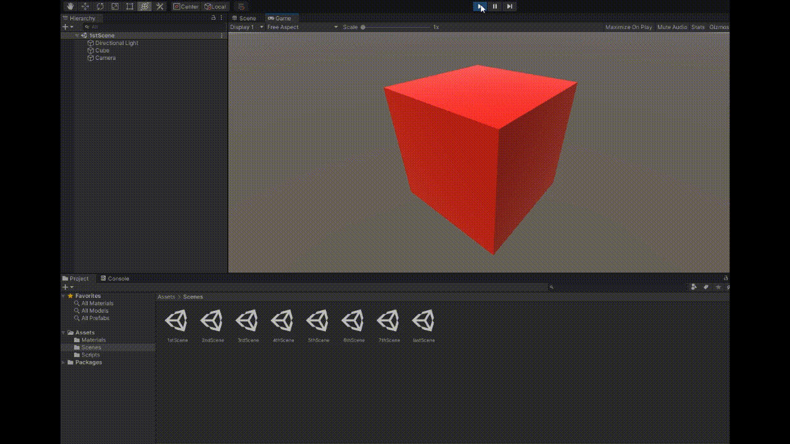
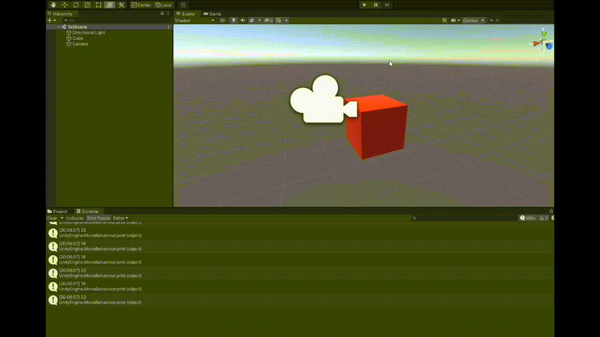
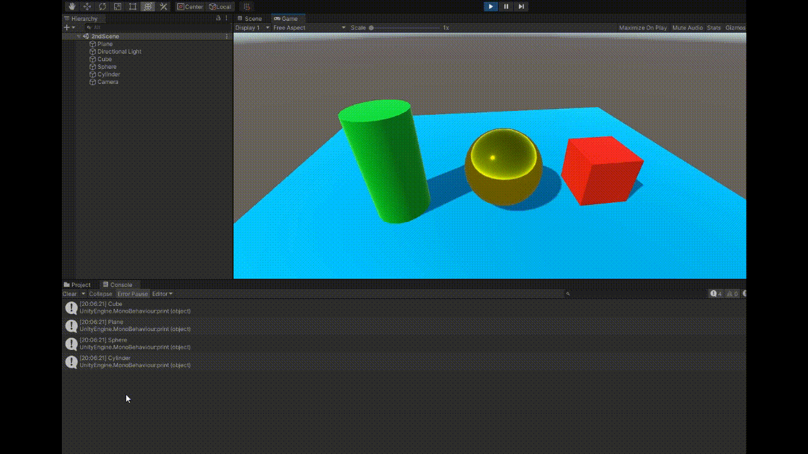
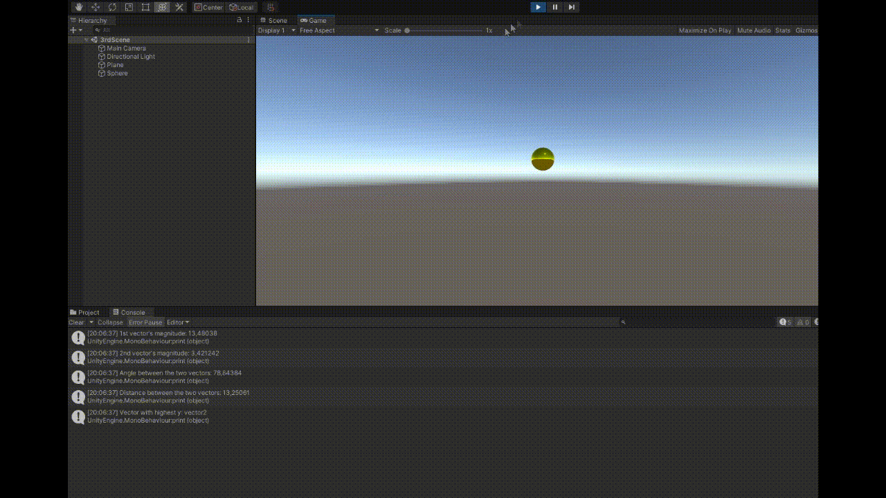
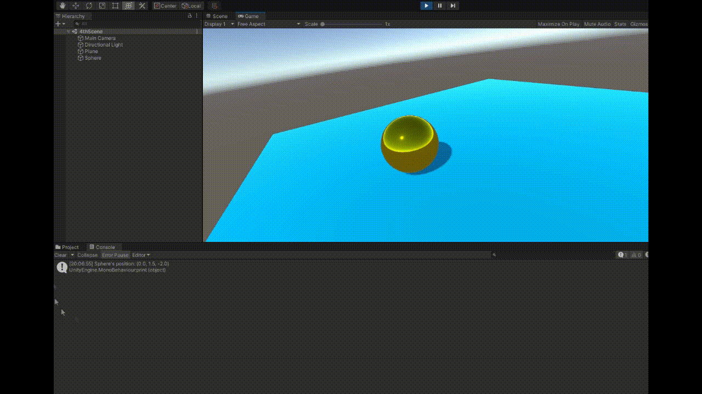
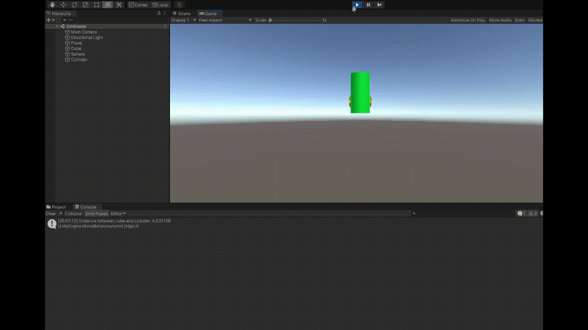
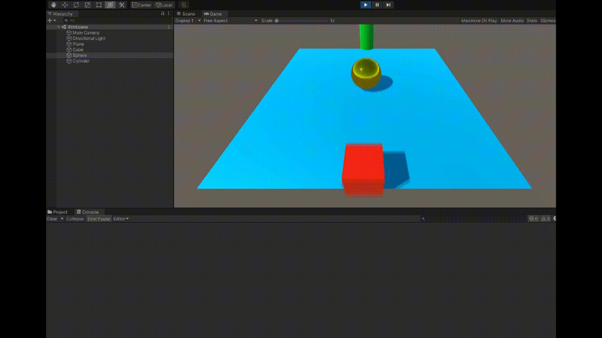
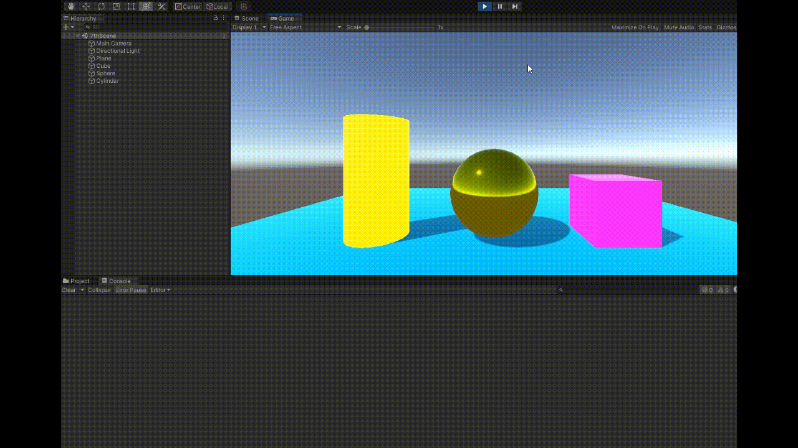

# Scripts
## Práctica 2 - Interfaces Inteligentes

En este repositorio se encuentra el segundo proyecto en Unity de la asignatura de Interfaces Inteligentes, en él, se debían crear varias escenas con objetos básicos para realizar diferentes objetivos a través de scripts

Pueden encontrarse todos los scripts en la carpeta Scripts del repo.

En el primer ejercicio se pedía crear un cubo que inicializase un array de valores entre 0 y 25 y cambiar en cada frame una posición, por último, parametrizar el rango y enseñar por pantalla aquellas posiciones mayores de 15.

En el segundo ejercicio se pedía ubicar un plano, cubo, esfera y cilindros y que cada elemento fuera de un color diferente además de decir por consola su nombre

El tercer ejercicio pedía crear un script asociado a la esfera que mostrase por la consola la magnitud de dos Vector3, el ángulo que forman, la distancia entre ambos y un mensaje indicando cual está a una altura (y) mayor

El cuarto ejericio pedía enseñar por consola el vector de la posición de la esfera

En el quinto, la distancia entre el cubo y el cilindro

En el sexto ejercicio, pedía alinear el cilindro con el cubo y la esfera a 5 uds. de distancia en el eje x

En el penúltimo ejercicio se crea un script de m,anera que sea posible cambiar el color del cilindro y del cubo cuando se pulse la tecla A y la tecla UpArrow

Y por último, se pide añadir 5 esferas extra, poner la mitad de ellas en un grupo y la mitad en otro y coger, de las esferas del segundo grupo, la más cercana a la esfera original y levantarla un poco y la más lejana cambiar su color al pulsar la tecla Space

